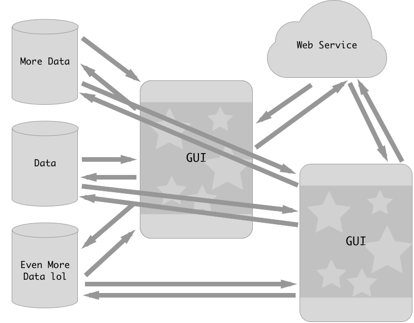
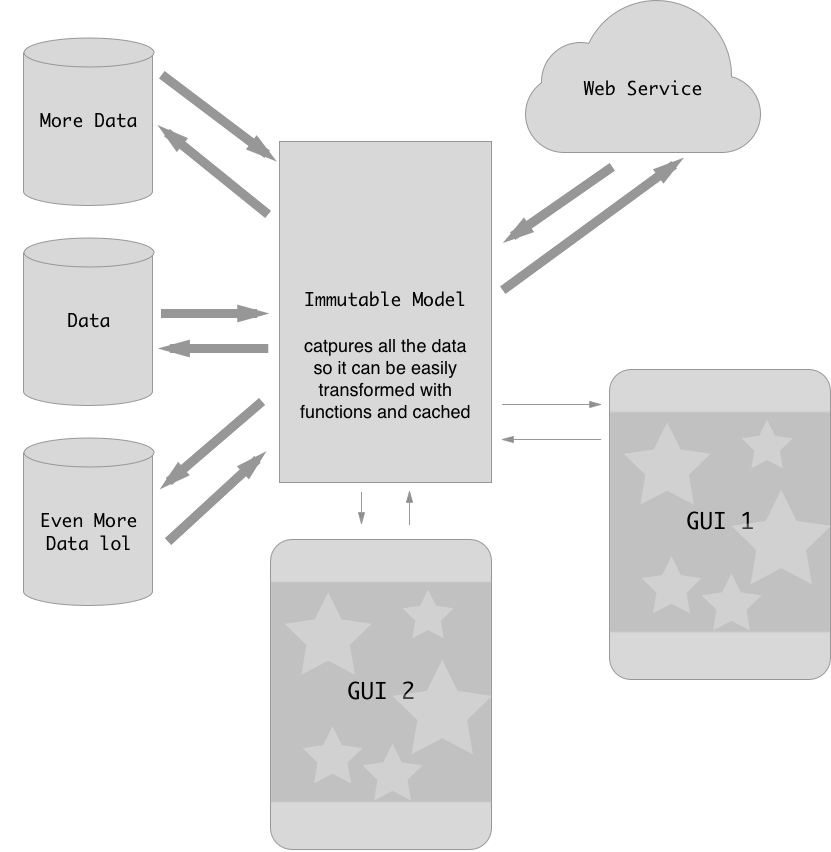
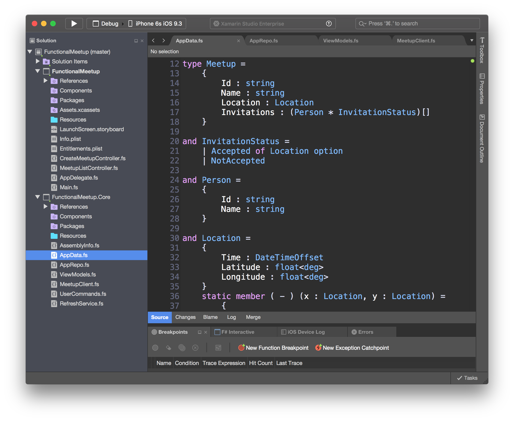
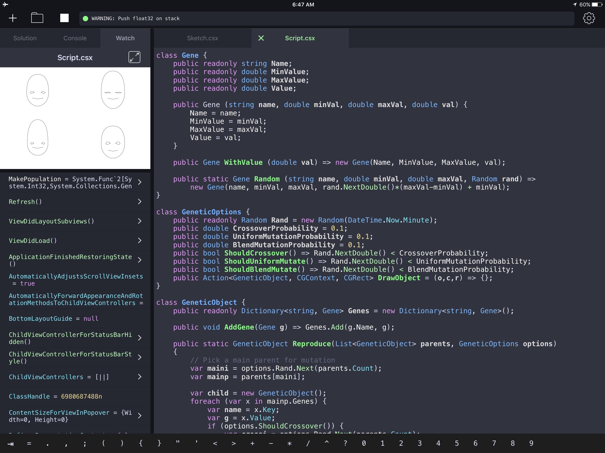
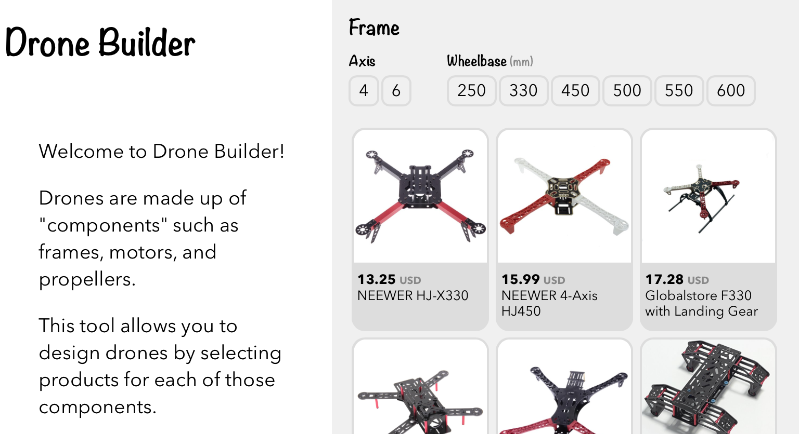

- title : Functional Programming for Mobile Apps
- description : Functional Programming for Mobile Apps
- author : Frank A. Krueger
- theme : black
- transition : default

***

### Functional Programming

## for Mobile Apps

# *

Frank A. Krueger

June 8, 2016 - NDC Oslo

*If you love programming, you're in the right room.*

***

# What is Functional Programming?

---

## A Functional Program Is

1. **Data**
2. **Functions** that transform some data into other data

---

## Pipeline

{Data} ➔ Function ➔ {Other Data}

---

## Longer Pipeline

{Data} ➔ Function ➔ {Other Data} ➔ Another Function ➔ {Very Fascinating Data}

---

## Task: Most Common Words

* **Given** the name of a text file
* **Display** the top 10 most repeated words

---

### Solution Pipeline

{File Name}
➔ Fun1 ➔ {Text} ➔ Fun2 ➔ {Words} ➔ Fun3 ➔ {Histogram}
➔ Fun4 ➔ {List} ➔ Display

1. Transform the *file name* into *text*
2. Transform the *text* into a *list of words*
3. Transform the *list of words* into a *histogram*
4. Transform the *histogram* into a *sorted list*
5. Display the *sorted list*

---

### Solution Code

    let readFile name = System.IO.File.ReadAllText name

    let getWords (text : string) = text.Split ' '

    let buildHistogram = Seq.countBy id

    let getList words =
        words
        |> Seq.sortByDescending snd
        |> Seq.truncate 10
        |> Seq.map fst

    let display list = list |> Seq.iter (printfn "%s")

---

### Final Solution

    let displayMostCommonWords =
        readFile >> getWords >> buildHistogram >> getList
        >> display

---

NOTE 1/3

#### Decomposed the big problem into smaller problems

- Important skill when solving hard problems
- Even smaller problems were decomposed
- Process continues until you write "obvious" functions

*(I like FP because it helps me solve hard problems.)*

---

NOTE 2/3

#### No data was ever mutated

- We never overwrote variables, never created a counter to increment,
  didn't set any properties, etc.

---

NOTE 3/3

#### Not purely functional!

- The *display* function is not a function, it didn't
  produce a value! *omg*

- Functional programming is a tool, not a religion

---

### Glossary

- **value** (n) data that cannot change
- **object** (n) a collection of objects,
    functions that can access and modify those objects, and events
- **mutate** (v) when an object changes its value but retains its identity
- **FP** (n) Functional Programming
- **OOP** (n) Object-Oriented Programming
- **GUI** (n) Graphical User Interface (aka Mobile App)

***

# What is a mobile app?

---

## A Mobile App is

1. A GUI
2. Lots of services
3. Lots of constraints (responsive, small, robust, ...)

---

## A GUI

1. Display *application data*
2. Receive *input* (from the user, services, ai, etc.)
3. Change in response
4. GOTO 1

---

A FUNCTIONAL GUI

### 1. Display *application data*

Just a function that produces GUI objects

---

A FUNCTIONAL GUI

### 2. Receive *input*

Events come from scary mutating objects

- Web Services
- Animation Libraries
- Operating System Events
- Background Processes
- Humans

---

A FUNCTIONAL GUI

### 3. Change in response

OK, I give up, this goes against everything FP

- Change GUI objects
- Change application data
- Call services, etc.

---

## Can't Make a Functional GUI 

It's not immediately obvious how to build GUIs with
FP

* Use OOP techniques for the GUI
* Use FP techniques when solving hard application specific problems
  (encapsulated in an object)

---

## Making a Functional GUI 

Apply FP techniques to the GUI by not being pure,

but we want benefits

---

### OOP GUI

---

### Functional GUI

***

FUNCTIONAL

# Rabbit Hole

---

## Rabbit Hole Agenda

1. Application Data
2. Displaying the UI
3. User Input
4. Other Events

---

## https://github.com/praeclarum/FunctionalMeetup

---

## Meetup App 

    type Meetup =
        {
            Id : string
            Name : string
            Location : Location
            Invitations : (Person * InvitationStatus)[]
        }
    and InvitationStatus =
        | Accepted of Location
        | NotAccepted
    and Person =
        {
            Id : string
            Name : string
        }
    and Location =
        {
            Time : DateTimeOffset
            Latitude : float<deg>
            Longitude : float<deg>
        }

---

## All your data in one place

Define a type that contains all the data your app needs to display its GUI

This is the input to the functions that comprise your app

---

### All the Data

    type AppData =
        {
            User : Person
            AuthToken : string
            
            Settings : AppSettings
            
            Location : Location
            Friends : Person[]
            Meetups : Meetup[]
        }
        
    and AppSettings =
        {
            ShareLocation : bool
        }    

---

### The Data Pointer Trick

Keep a pointer to the current AppData

When the app needs to "change":

1. Create new AppData from the current
2. Mutate the pointer to point at the new AppData

---

## Object to Coordintate Updates

    type AppRepo (initialData : AppData) =
    
        let mutable data = initialData
        
        member this.Data = data

        /// The only way to change the app data
        member this.UpdateData (newData) =
            data <- newData
            
---

## Coordintate Updates with Events

    type AppRepo (initialData : AppData) =
    
        let mutable data = initialData
        let updatedData = Event<unit> ()
        
        member this.Data = data

        /// Fired whenever the data changes
        member this.UpdatedData = updatedData.Publish
        
        /// The only way to change the app data
        member this.UpdateData (newData) =
            data <- newData
            updatedData.Trigger ()
            
---

### Free Undo and Redo

Instead of

    data <- newData

Save the history

    let mutable history = [ initialData ]
    let mutable historyIndex = 0
    
    member this.Data = history.[historyIndex]
    member this.UpdateData _ =
        //...
        history <- newData :: history
        historyIndex <- 0
        
    member this.Undo () =
        historyIndex <- historyIndex + 1
        updatedData.Trigger

---
            
### Transactional Updates

    let dataLock = new obj()
    
    /// The only way to change the app data
    member this.UpdateData (update : AppData -> AppData option) =
        let mutable updated = false
        lock dataLock (fun () ->
            match update data with
            | None -> ()
            | Some newData ->
                data <- newData
                updated <- true)
        if updated then
            Task.Run updatedData.Trigger |> ignore
            
---

## Generating UI

Two approaches:

1. Generate *UI objects directly* from the application data
2. Generate *View Models* that are consumed by OOP UI objects 

---

### UI Objects from Data

Most functionally pure solution

    module UI =
    
        let rec makeApp (data : AppData) =
            let tabs = new UITabBarController ()
            tabs.SetViewControllers [|
                                        makeMeetupList data
                                        makeMap data
                                        makeFriendList data
                                        makeSettings data
                                    |]
            tabs
            
        and makeMeetupList data =
            new UITableViewController ()        
        
---     

### Problem is...

This doesn't work.    

Most UI frameworks weren't designed to have their object graphs rewritten constantly

---

### Hybrid Solution

Create UI objects in OOP style and bind them to *View Models*

---

### Define View Models

    module ViewModels =
    
        type MeetupList =
            {
                Title : string
                Items : MeetupListItem[]
            }
        and MeetupListItem =
            {
                Title : string
                BackgroundColor : Color
            }
        type Map =
            {
                NextMeetup : Meetup option
            }

---

### Make View Models

    let makeMeetupList (data : AppData) =
        let makeItem (m : Meetup) =
            {
                Title = m.Name
                BackgroundColor =
                    let distance = m.Location - data.Location
                    if distance.IsNear then Colors.Green
                    else Colors.Clear
            }            
        {
            Title = "My Meetups"
            Items = data.Meetups |> Array.map makeItem
        }
        
---

### UI Object Pattern

1. Create with the function needed to generate its view model from the app data

2. Monitor the *AppRepo.UpdatedData* event for changes

    * When the data changes, reload the view model
    * Compare the new view model against the last one
    * If the models are different, then update the UI object

3. When the user inputs something, update the app data using the app repo

---

#### Meetup List

    type MeetupListController (repo : AppRepo) =
        inherit UITableViewController (Title = "Meetups")

        let mutable viewModel = None

        member this.UpdateViewModel () =
            let data = repo.Data
            let newViewModel = Some (ViewModels.makeMeetupList data)
            if viewModel <> newViewModel then
                this.BeginInvokeOnMainThread (fun () ->
                    viewModel <- newViewModel
                    this.TableView.ReloadData ())
                    
        override this.ViewDidAppear (a) =
            base.ViewDidAppear (a)
            sub <- Some (repo.UpdatedData.Subscribe
                        this.UpdateViewModel)
            this.UpdateViewModel ()

---

#### Immutability FTW

Note that we used immutability to minimize the number of times we refresh
the UI

While immutability of your view models is not required, it keeps code clean

---

### User Input

When the user inputs data, it's time to call the *UpdateData* function on the repo

The view has two choices then:

1. Sit around and wait for the **UpdatedData** event to refresh
    - This is sufficient for most UI objects
2. Present new UI or otherwise re-arrange things
            
---

#### Creating a new Meetup

Three steps:

1. Validate the user input
2. Send the request to the server
3. Update our internal data with the server response

---

#### Service Client

Let's define our client to the server as an interface

Helps for testability and keeps presentation code short

    type IMeetupClient =

        abstract CreateMeetupAsync : string -> string -> Location
            -> Async<Meetup>
        abstract GetMeetupsAsync : string -> Async<Meetup[]>
        
        abstract FindPersonAsync : string -> Async<Person option>
        abstract AddFriendAsync : string -> string -> Async<Person>
        abstract GetFriendsAsync : string -> Async<Person[]>

---

#### Create New Meetup Code

    type UserCommands (client : IMeetupClient, repo:AppRepo) =        
        member this.ValidateCreateMeetup (name : string) =
            if String.IsNullOrWhiteSpace (name) then
                Invalid "Name must be given"
            else Valid        
        member this.CreateMeetupAsync (userId:string)
                                    (name:string) (loc:Location) =
            async {
                let v = this.ValidateCreateMeetup name
                v.ThrowIfInvalid ()
                
                let! serverMeetup =
                    client.CreateMeetupAsync userId name loc
                
                repo.UpdateData (fun data ->
                    let newMeetups = Array.append [|serverMeetup|]
                                                data.Meetups
                    Some { data with Meetups = newMeetups }) 
            }                

---

#### Create New Meetup UI Code

type CreateMeetupController (cmds : UserCommands) =
    inherit DialogViewController (new RootElement("New Meetup"))

    member this.OnClickCreate () =
        async {
            try
                let name, loc = this.GetMeetupFromUI ()
                do! cmds.CreateMeetupAsync cmds.Repo.Data.User.Id
                                           name loc
                this.DismissViewController (true, null)
            with e ->
                this.ShowError ("Create Meetup Failed", e)
        }
        |> Async.StartImmediate

---

## Services

We have a model, view models, and a GUI, but no data!

Same pattern as UI objects!

---

## Background Refresh Service

    type RefreshService (client:IMeetupClient, repo:AppRepo) =
        member this.RefreshAsync () =
            async {
                let! newMeetups =
                    client.GetMeetupsAsync repo.Data.User.Id
                repo.UpdateData (fun data ->
                    Some { data with Meetups = newMeetups }) 
            }
        
        member this.Start (cancelToken) =
            let loop =
                async {                
                    while true do
                        do! Async.Sleep (int updatePeriod)
                        try do! this.RefreshAsync ()
                        with ex -> this.LogError ex
                }
            Async.Start (loop, cancelToken)

---

### Rabbit Hole Summary

* Constrain mutation to a single app object

* Use functions to create view models from app data
    - Great for cross platform and testing 

* Establish a pattern for UI objects to follow to
    - Keep them fresh
    - Verify events are unsubscribed

* All views display data from one source
    - Keeps everything reactive and in sync
    
* Background services follow the same update rules as user commands    
    

***

# Tips & Tricks

---

## Don't Think about doing things, think about goals

and write services that achieve those goals

---

### An IDE

---

#### On Key Press

1. Syntax Color
2. Code Completion
3. Save
4. Rebuild & run

Problematic because have to remember
to call each of these functions at the right times

---

#### Instead, use services

    type ColorService(repo) =
        member this.OnUpdatedData () =
            if this.NeedsUpdateColors repo.Data then
                repo.UpdateData (this.UpdateColors) 

    type CompletionService(repo) =
        member this.OnUpdatedData () =
            if this.NeedsUpdateCompletions repo.Data then
                repo.UpdateData (this.UpdateCompletions)                 

---

### Command Queue

Instead of doing operations:

1. Queue them in the AppData

2. Services can execute and dequeue them

This is CQRS and fits very naturally into this architecture.

(Command Query Responsibility Separation) 

---

#### Simple Command Queue

    type AppData =
        {
            //...
            Commands : Command[]
        }
        member this.QueueCommand c =
            { this with
                Commands = Array.append this.Commands [|c|]}
                
    and Command =
        | CreateMeetup of Meetup
        | Invite of Meetup * Person
        //...

---

## Messages in Update

    member this.Update (message : string) updater =
        //...

Gives a transaction log - commits and rollbacks

Find out which service caused problems by scanning this log

Even record branches for full git-like history

---

## Use F\# Mailboxes

Fits well with decoupling data, services, and UI

---

## Share Code with the Server

1. Share your model data types
2. Share view model functions to make web apps

***

# Who's Doing This?

---

## ReactiveX

"Rx = Observables + LINQ + Schedulers" 

http://reactivex.io

---

## React.js

"The V in MVC"

"One-way reactive data flow"

http://facebook.github.io/react/

---

### Based on Reactive Components

Each component:

1. Is a container for subcomponents that it generates with a function
2. Is immutable with respect to contstruction time "properties"
3. Some (rare) mutation is allowed of "state" for interactivity
4. Can efficiently be cached by checking if properties changed

---

### Isn't that inefficient?

Problem: HTML has same problems as native mobile apps: you can't keep
recreating the UI

Solution: "Shadow DOM" is generated and then merged with real DOM

---

### Use React

http://drone.mecha.parts

F# App using React.js

---

## Elm

A Haskell for writing web apps

"the best of functional programming in your browser"

http://elm-lang.org

---

### Elm Architecture

"A simple pattern for infinitely nestable components"

Each component:

1. Defines a "Model" type
2. Defines a "View" function
3. Defines an "Update" function
    - Different updates defined with "Messages"
    
* Also uses a shadow DOM

---

### Elm Example in F#

    type Model = int

    type UpdateMsg =
        | Increment
        | Decrement

    let update msg model =
        match msg with
        | Reset -> model - 1
        | AddOne -> model + 1

    let view model =
        div [] [ button [onClick Increment] [text, "+"]
                 div [] [text (model.ToString())]
                 button [onClick Decrement] [text, "-"] ]
        

***

# Conclusion

* Functional Programming is Great!
* Can be used to solve common mobile app problems by
    - breaking them down into simpler problems
    - reducing coupling
* Can be used in small doses, rabbit sized doses, or web scale

---

# Thank you!

## *

https://github.com/praeclarum/FunctionalMeetup

## *

@praeclarum

